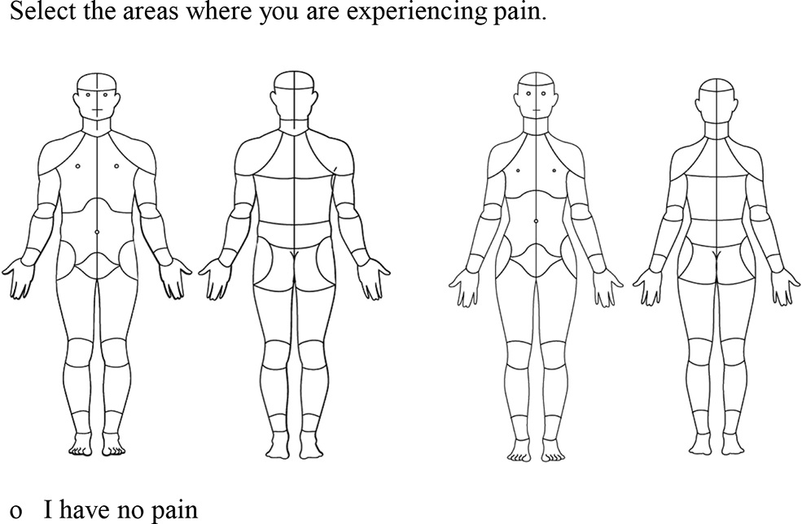

<!-- README.md is generated from README.Rmd. Please edit that file -->

```{r, include = FALSE}
knitr::opts_chunk$set(
  collapse = TRUE,
  comment = "#>",
  fig.path = "man/figures/README-",
  out.width = "100%"
)
```

# CHOIRBM

<!-- badges: start -->
<!-- badges: end -->

CHOIRBM is a collection of plotting utilities for the [Collaborative Health Outcomes Information Registry's](https://choir.stanford.edu) Body Map (CBM). The CBM is an instrument for assessing the distribution of a patient's pain, and has been validated in a paper published in [_Pain Reports_ (Scherrer et al 2021)](https://doi.org/10.1097/pr9.0000000000000880). The package is built on top of the popular R plotting package `ggplot2`, and returns plots as ggplot objects.

Sample of the CBM in clinical use:
```{r img, echo = FALSE}

```

## Installation

You can install the released version of CHOIRBM from [CRAN](https://CRAN.R-project.org) with:

``` r
install.packages("CHOIRBM")
```

Or install the development version from GitHub with:

``` r
devtools::install_github("emcramer/CHOIRBM")
remotes::install_github("emcramer/CHOIRBM")
```

## Examples
### Plotting the Male CBM
This is a basic example which shows you how to plot the front and back parts of the male CHOIR Body Map:

```{r male_example, fig.height=3}
library(CHOIRBM)

# generate some random example data
set.seed(123)
ids <- as.character(c(seq.int(101, 136, 1), seq.int(201, 238, 1)))
values <- data.frame(
  id = ids
  , value = runif(length(ids))
  , ucolors = rainbow(length(ids))
  , group = ifelse(as.numeric(ids) < 200, "Front", "Back")
)

# plot the data on the front of the CHOIR body map
plot_male_choirbm(values, "value")

# plot each segment of the bodymap as a different color
plot_male_choirbm(values, "ucolors")
```

### Plotting the female CBM
And an additional example with the female CHOIR Body Map:

```{r female_example, fig.height=3}
library(CHOIRBM)

# generate some random example data
exdata <- gen_example_data()

# plot the data on the front of the CHOIR body map
plot_female_choirbm(exdata, "value")
```

Check the vignettes for more examples such as plotting individual patients, highlighting specific segments, and changing color schemes.

## Citations:
> Scherrer, Kristen Hymel; Ziadni, Maisa S; Kong, Jiang-Tia; Sturgeon, John A; Salmasi, Vafia; Hong, Juliette; Cramer, Eric; Chen, Abby L; Pacht, Teresa; Olson, Garrick; Darnall, Beth D; Kao, Ming-Chih; Mackey, Sean. Development and validation of the Collaborative Health Outcomes Information Registry body map, PAIN Reports: January/February 2021 - Volume 6 - Issue 1 - p e880
doi: [10.1097/PR9.0000000000000880](https://doi.org/10.1097/pr9.0000000000000880)
