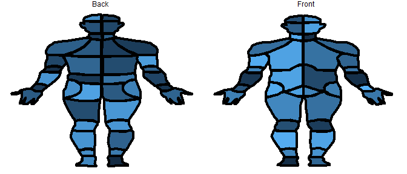
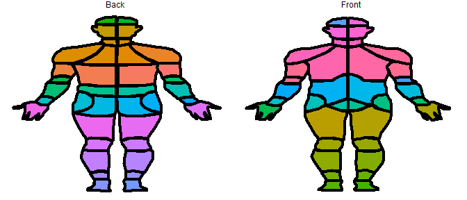
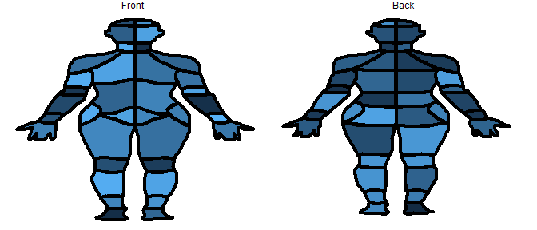

<!-- README.md is generated from README.Rmd. Please edit that file -->

# CHOIRBM

<!-- badges: start -->
<!-- badges: end -->

CHOIRBM is a collection of plotting utilities for the [Collaborative
Health Outcomes Information Registry’s](http://www.choir.stanford.edu)
Body Map (CBM). The CBM is an instrument for assessing the distribution
of a patient’s pain, and has been validated in a paper published in
[*Pain Reports* (Scherrer et al
2021)](https://doi.org/10.1097/pr9.0000000000000880).


## Installation

~~You can install the released version of CHOIRBM from
[CRAN](https://CRAN.R-project.org) with:~~ (Not on CRAN…yet)

``` r
install.packages("CHOIRBM")
```

Or install from GitHub with:

``` r
devtools::install_github("emcramer/CHOIRBM")
remotes::install_github("emcramer/CHOIRBM")
```

## Example

This is a basic example which shows you how to plot the front and back
parts of the male CHOIR Body Map:

``` r
library(CHOIRBM)

# generate some random example data
set.seed(123)
ids <- as.character(c(seq.int(101, 136, 1), seq.int(201, 238, 1)))
values <- data.frame(
  id = ids
  , value = runif(length(ids))
  , ucolors = rainbow(length(ids))
  , group = ifelse(as.numeric(ids) < 200, "Front", "Back")
)

# plot the data on the front of the CHOIR body map
plot_male_choirbm(values, "value")
```



``` r
# plot each segment of the bodymap as a different color
plot_male_choirbm(values, "ucolors")
```



And an additional example with the female CHOIR Body Map:

``` r
library(CHOIRBM)

# generate some random example data
exdata <- gen_example_data()

# plot the data on the front of the CHOIR body map
plot_female_choirbm(exdata, "value")
```



## Citations:

> Scherrer, Kristen Hymela,b; Ziadni, Maisa S.a; Kong, Jiang-Tia;
> Sturgeon, John A.c; Salmasi, Vafia; Hong, Juliettea; Cramer, Erica;
> Chen, Abby L.a; Pacht, Teresaa; Olson, Garricka; Darnall, Beth D.a;
> Kao, Ming-Chiha; Mackey, Seana,\* Development and validation of the
> Collaborative Health Outcomes Information Registry body map, PAIN
> Reports: January/February 2021 - Volume 6 - Issue 1 - p e880 doi:
> [10.1097/PR9.0000000000000880](https://doi.org/10.1097/pr9.0000000000000880)
