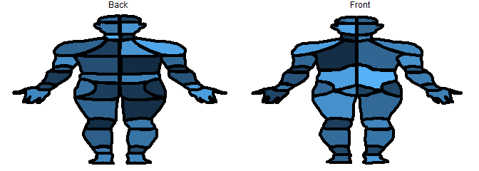

<!-- README.md is generated from README.Rmd. Please edit that file -->

# CHOIRBM

<!-- badges: start -->
<!-- badges: end -->

The goal of CHOIRBM is to …

## Installation

You can install the released version of CHOIRBM from
[CRAN](https://CRAN.R-project.org) with:

``` r
install.packages("CHOIRBM")
```

Or install from GitHub with:

``` r
devtools::install_github("emcramer/CHOIRBM")
```

## Example

This is a basic example which shows you how to the front part of the
male CHOIR Body Map:

``` r
library(CHOIRBM)

# generate some random example data
ids <- as.character(c(seq.int(101, 136, 1), seq.int(201, 238, 1)))
values <- data.frame(
  id = ids
  , value = runif(length(ids))
  , group = ifelse(as.numeric(ids) < 200, "Front", "Back")
)

# plot the data on the front of the CHOIR body map
plot_male_choirbm(values)
#>       id       value group   x   y
#> 1    101 0.940301858 Front 140  43
#> 2    101 0.940301858 Front 140  19
#> 3    101 0.940301858 Front 140  18
#> 4    101 0.940301858 Front 132  18
#> 5    101 0.940301858 Front 126  20
#> 6    101 0.940301858 Front 121  22
#> 7    101 0.940301858 Front 118  26
#> 8    101 0.940301858 Front 115  30
#> 9    101 0.940301858 Front 114  34
#> 10   101 0.940301858 Front 115  39
#> 11   101 0.940301858 Front 126  41
#> 12   101 0.940301858 Front 130  42
#> 13   101 0.940301858 Front 140  43
#> 14   102 0.095164244 Front 165  40
#> 15   102 0.095164244 Front 165  31
#> 16   102 0.095164244 Front 162  25
#> 17   102 0.095164244 Front 158  21
#> 18   102 0.095164244 Front 153  19
#> 19   102 0.095164244 Front 147  18
#> 20   102 0.095164244 Front 141  18
#> 21   102 0.095164244 Front 141  42
#> 22   102 0.095164244 Front 152  42
#> 23   102 0.095164244 Front 159  41
#> 24   102 0.095164244 Front 165  40
#> 25   103 0.494445350 Front 114  40
#> 26   103 0.494445350 Front 130  43
#> 27   103 0.494445350 Front 140  43
#> 28   103 0.494445350 Front 140  84
#> 29   103 0.494445350 Front 123  80
#> 30   103 0.494445350 Front 118  75
#> 31   103 0.494445350 Front 117  66
#> 32   103 0.494445350 Front 109  55
#> 33   103 0.494445350 Front 109  49
#> 34   103 0.494445350 Front 110  47
#> 35   103 0.494445350 Front 113  47
#> 36   103 0.494445350 Front 116  50
#> 37   103 0.494445350 Front 115  46
#> 38   103 0.494445350 Front 114  40
#> 39   104 0.288034485 Front 141  84
#> 40   104 0.288034485 Front 150  83
#> 41   104 0.288034485 Front 156  81
#> 42   104 0.288034485 Front 160  78
#> 43   104 0.288034485 Front 163  72
#> 44   104 0.288034485 Front 163  66
#> 45   104 0.288034485 Front 170  56
#> 46   104 0.288034485 Front 172  49
#> 47   104 0.288034485 Front 170  47
#> 48   104 0.288034485 Front 167  47
#> 49   104 0.288034485 Front 164  49
#> 50   104 0.288034485 Front 165  46
#> 51   104 0.288034485 Front 165  41
#> 52   104 0.288034485 Front 149  42
#> 53   104 0.288034485 Front 141  43
#> 54   104 0.288034485 Front 141  84
#> 55   105 0.431841462 Front 140 108
#> 56   105 0.431841462 Front 140  85
#> 57   105 0.431841462 Front 125  81
#> 58   105 0.431841462 Front 122  81
#> 59   105 0.431841462 Front 122  96
#> 60   105 0.431841462 Front 119  99
#> 61   105 0.431841462 Front 129 105
#> 62   105 0.431841462 Front 140 108
#> 63   106 0.330173564 Front 158  81
#> 64   106 0.330173564 Front 158  98
#> 65   106 0.330173564 Front 160  99
#> 66   106 0.330173564 Front 150 106
#> 67   106 0.330173564 Front 144 108
#> 68   106 0.330173564 Front 141 108
#> 69   106 0.330173564 Front 141  85
#> 70   106 0.330173564 Front 148  84
#> 71   106 0.330173564 Front 154  82
#> 72   106 0.330173564 Front 158  81
#> 73   107 0.036795120 Front 119  99
#> 74   107 0.036795120 Front  94 111
#> 75   107 0.036795120 Front  81 114
#> 76   107 0.036795120 Front  73 118
#> 77   107 0.036795120 Front  67 125
#> 78   107 0.036795120 Front  65 133
#> 79   107 0.036795120 Front  61 148
#> 80   107 0.036795120 Front  62 163
#> 81   107 0.036795120 Front  78 157
#> 82   107 0.036795120 Front  93 146
#> 83   107 0.036795120 Front 101 138
#> 84   107 0.036795120 Front 113 125
#> 85   107 0.036795120 Front 122 109
#> 86   107 0.036795120 Front 125 103
#> 87   107 0.036795120 Front 119  99
#> 88   108 0.145164149 Front 140 195
#> 89   108 0.145164149 Front 140 109
#> 90   108 0.145164149 Front 131 106
#> 91   108 0.145164149 Front 125 103
#> 92   108 0.145164149 Front 116 121
#> 93   108 0.145164149 Front 109 130
#> 94   108 0.145164149 Front 101 139
#> 95   108 0.145164149 Front  93 147
#> 96   108 0.145164149 Front  85 153
#> 97   108 0.145164149 Front  90 162
#> 98   108 0.145164149 Front  91 170
#> 99   108 0.145164149 Front  91 180
#> 100  108 0.145164149 Front  90 187
#> 101  108 0.145164149 Front  92 197
#> 102  108 0.145164149 Front  93 210
#> 103  108 0.145164149 Front  94 216
#> 104  108 0.145164149 Front 111 216
#> 105  108 0.145164149 Front 117 215
#> 106  108 0.145164149 Front 121 213
#> 107  108 0.145164149 Front 125 206
#> 108  108 0.145164149 Front 130 200
#> 109  108 0.145164149 Front 134 196
#> 110  108 0.145164149 Front 140 195
#> 111  109 0.235232676 Front 155 103
#> 112  109 0.235232676 Front 162 115
#> 113  109 0.235232676 Front 171 128
#> 114  109 0.235232676 Front 177 135
#> 115  109 0.235232676 Front 188 146
#> 116  109 0.235232676 Front 197 153
#> 117  109 0.235232676 Front 193 160
#> 118  109 0.235232676 Front 190 171
#> 119  109 0.235232676 Front 190 182
#> 120  109 0.235232676 Front 191 190
#> 121  109 0.235232676 Front 188 208
#> 122  109 0.235232676 Front 187 216
#> 123  109 0.235232676 Front 171 216
#> 124  109 0.235232676 Front 164 214
#> 125  109 0.235232676 Front 160 212
#> 126  109 0.235232676 Front 157 206
#> 127  109 0.235232676 Front 152 200
#> 128  109 0.235232676 Front 147 197
#> 129  109 0.235232676 Front 145 195
#> 130  109 0.235232676 Front 141 195
#> 131  109 0.235232676 Front 141 109
#> 132  109 0.235232676 Front 146 107
#> 133  109 0.235232676 Front 151 105
#> 134  109 0.235232676 Front 155 103
#> 135  110 0.397675363 Front 219 162
#> 136  110 0.397675363 Front 205 157
#> 137  110 0.397675363 Front 199 153
#> 138  110 0.397675363 Front 190 147
#> 139  110 0.397675363 Front 181 138
#> 140  110 0.397675363 Front 173 130
#> 141  110 0.397675363 Front 167 121
#> 142  110 0.397675363 Front 162 113
#> 143  110 0.397675363 Front 156 103
#> 144  110 0.397675363 Front 160  99
#> 145  110 0.397675363 Front 169 102
#> 146  110 0.397675363 Front 180 107
#> 147  110 0.397675363 Front 187 111
#> 148  110 0.397675363 Front 195 113
#> 149  110 0.397675363 Front 203 115
#> 150  110 0.397675363 Front 210 121
#> 151  110 0.397675363 Front 214 127
#> 152  110 0.397675363 Front 217 134
#> 153  110 0.397675363 Front 220 145
#> 154  110 0.397675363 Front 219 162
#> 155  111 0.412079253 Front  85 207
#> 156  111 0.412079253 Front  89 187
#> 157  111 0.412079253 Front  91 180
#> 158  111 0.412079253 Front  91 170
#> 159  111 0.412079253 Front  89 162
#> 160  111 0.412079253 Front  85 153
#> 161  111 0.412079253 Front  77 158
#> 162  111 0.412079253 Front  67 162
#> 163  111 0.412079253 Front  62 163
#> 164  111 0.412079253 Front  62 169
#> 165  111 0.412079253 Front  63 178
#> 166  111 0.412079253 Front  62 185
#> 167  111 0.412079253 Front  62 204
#> 168  111 0.412079253 Front  69 203
#> 169  111 0.412079253 Front  69 202
#> 170  111 0.412079253 Front  77 203
#> 171  111 0.412079253 Front  80 204
#> 172  111 0.412079253 Front  85 207
#> 173  112 0.115563906 Front 220 205
#> 174  112 0.115563906 Front 211 203
#> 175  112 0.115563906 Front 205 203
#> 176  112 0.115563906 Front 199 206
#> 177  112 0.115563906 Front 197 208
#> 178  112 0.115563906 Front 193 195
#> 179  112 0.115563906 Front 191 183
#> 180  112 0.115563906 Front 189 172
#> 181  112 0.115563906 Front 192 161
#> 182  112 0.115563906 Front 197 153
#> 183  112 0.115563906 Front 204 156
#> 184  112 0.115563906 Front 212 160
#> 185  112 0.115563906 Front 219 163
#> 186  112 0.115563906 Front 218 173
#> 187  112 0.115563906 Front 219 180
#> 188  112 0.115563906 Front 220 194
#> 189  112 0.115563906 Front 220 205
#> 190  113 0.788870197 Front  81 222
#> 191  113 0.788870197 Front  81 216
#> 192  113 0.788870197 Front  84 208
#> 193  113 0.788870197 Front  77 203
#> 194  113 0.788870197 Front  69 203
#> 195  113 0.788870197 Front  63 204
#> 196  113 0.788870197 Front  61 205
#> 197  113 0.788870197 Front  60 212
#> 198  113 0.788870197 Front  55 219
#> 199  113 0.788870197 Front  62 224
#> 200  113 0.788870197 Front  77 224
#> 201  113 0.788870197 Front  81 222
#> 202  114 0.434425207 Front 200 222
#> 203  114 0.434425207 Front 200 215
#> 204  114 0.434425207 Front 197 208
#> 205  114 0.434425207 Front 203 203
#> 206  114 0.434425207 Front 212 203
#> 207  114 0.434425207 Front 215 204
#> 208  114 0.434425207 Front 220 205
#> 209  114 0.434425207 Front 220 212
#> 210  114 0.434425207 Front 225 217
#> 211  114 0.434425207 Front 226 221
#> 212  114 0.434425207 Front 220 224
#> 213  114 0.434425207 Front 206 224
#> 214  114 0.434425207 Front 200 222
#> 215  115 0.869448590 Front  46 267
#> 216  115 0.869448590 Front  49 251
#> 217  115 0.869448590 Front  49 243
#> 218  115 0.869448590 Front  51 230
#> 219  115 0.869448590 Front  55 220
#> 220  115 0.869448590 Front  61 224
#> 221  115 0.869448590 Front  70 225
#> 222  115 0.869448590 Front  78 225
#> 223  115 0.869448590 Front  81 223
#> 224  115 0.869448590 Front  81 235
#> 225  115 0.869448590 Front  79 244
#> 226  115 0.869448590 Front  76 252
#> 227  115 0.869448590 Front  74 257
#> 228  115 0.869448590 Front  69 267
#> 229  115 0.869448590 Front  64 274
#> 230  115 0.869448590 Front  61 270
#> 231  115 0.869448590 Front  56 267
#> 232  115 0.869448590 Front  52 267
#> 233  115 0.869448590 Front  46 267
#> 234  116 0.009026019 Front  95 217
#> 235  116 0.009026019 Front  94 232
#> 236  116 0.009026019 Front  92 240
#> 237  116 0.009026019 Front  92 245
#> 238  116 0.009026019 Front  92 256
#> 239  116 0.009026019 Front  97 258
#> 240  116 0.009026019 Front 103 261
#> 241  116 0.009026019 Front 107 264
#> 242  116 0.009026019 Front 111 271
#> 243  116 0.009026019 Front 111 276
#> 244  116 0.009026019 Front 112 287
#> 245  116 0.009026019 Front 110 292
#> 246  116 0.009026019 Front 116 291
#> 247  116 0.009026019 Front 119 288
#> 248  116 0.009026019 Front 123 285
#> 249  116 0.009026019 Front 129 279
#> 250  116 0.009026019 Front 129 279
#> 251  116 0.009026019 Front 137 273
#> 252  116 0.009026019 Front 140 273
#> 253  116 0.009026019 Front 140 247
#> 254  116 0.009026019 Front 140 197
#> 255  116 0.009026019 Front 137 196
#> 256  116 0.009026019 Front 130 200
#> 257  116 0.009026019 Front 125 207
#> 258  116 0.009026019 Front 120 214
#> 259  116 0.009026019 Front 112 216
#> 260  116 0.009026019 Front 109 216
#> 261  116 0.009026019 Front  95 217
#> 262  117 0.731414550 Front 171 290
#> 263  117 0.731414550 Front 165 290
#> 264  117 0.731414550 Front 158 286
#> 265  117 0.731414550 Front 149 277
#> 266  117 0.731414550 Front 145 274
#> 267  117 0.731414550 Front 141 273
#> 268  117 0.731414550 Front 141 196
#> 269  117 0.731414550 Front 146 196
#> 270  117 0.731414550 Front 151 200
#> 271  117 0.731414550 Front 155 205
#> 272  117 0.731414550 Front 159 212
#> 273  117 0.731414550 Front 164 215
#> 274  117 0.731414550 Front 169 216
#> 275  117 0.731414550 Front 187 217
#> 276  117 0.731414550 Front 187 231
#> 277  117 0.731414550 Front 189 238
#> 278  117 0.731414550 Front 189 251
#> 279  117 0.731414550 Front 189 256
#> 280  117 0.731414550 Front 184 258
#> 281  117 0.731414550 Front 179 260
#> 282  117 0.731414550 Front 176 263
#> 283  117 0.731414550 Front 173 266
#> 284  117 0.731414550 Front 171 271
#> 285  117 0.731414550 Front 170 276
#> 286  117 0.731414550 Front 171 290
#> 287  118 0.779489012 Front 200 223
#> 288  118 0.779489012 Front 201 239
#> 289  118 0.779489012 Front 203 246
#> 290  118 0.779489012 Front 209 261
#> 291  118 0.779489012 Front 217 274
#> 292  118 0.779489012 Front 221 270
#> 293  118 0.779489012 Front 227 267
#> 294  118 0.779489012 Front 233 268
#> 295  118 0.779489012 Front 235 267
#> 296  118 0.779489012 Front 233 254
#> 297  118 0.779489012 Front 232 243
#> 298  118 0.779489012 Front 230 231
#> 299  118 0.779489012 Front 228 226
#> 300  118 0.779489012 Front 226 221
#> 301  118 0.779489012 Front 222 223
#> 302  118 0.779489012 Front 218 224
#> 303  118 0.779489012 Front 207 225
#> 304  118 0.779489012 Front 203 224
#> 305  118 0.779489012 Front 200 223
#> 306  119 0.311742934 Front  56 289
#> 307  119 0.311742934 Front  64 274
#> 308  119 0.311742934 Front  60 270
#> 309  119 0.311742934 Front  54 268
#> 310  119 0.311742934 Front  46 268
#> 311  119 0.311742934 Front  41 280
#> 312  119 0.311742934 Front  38 282
#> 313  119 0.311742934 Front  38 286
#> 314  119 0.311742934 Front  39 288
#> 315  119 0.311742934 Front  42 291
#> 316  119 0.311742934 Front  45 292
#> 317  119 0.311742934 Front  52 293
#> 318  119 0.311742934 Front  56 289
#> 319  120 0.061297204 Front  86 312
#> 320  120 0.061297204 Front  87 291
#> 321  120 0.061297204 Front  90 272
#> 322  120 0.061297204 Front  91 257
#> 323  120 0.061297204 Front  96 258
#> 324  120 0.061297204 Front 102 261
#> 325  120 0.061297204 Front 106 265
#> 326  120 0.061297204 Front 110 271
#> 327  120 0.061297204 Front 112 277
#> 328  120 0.061297204 Front 112 289
#> 329  120 0.061297204 Front 109 295
#> 330  120 0.061297204 Front 106 300
#> 331  120 0.061297204 Front 103 304
#> 332  120 0.061297204 Front  99 307
#> 333  120 0.061297204 Front  93 310
#> 334  120 0.061297204 Front  86 312
#> 335  121 0.466685368 Front 140 274
#> 336  121 0.466685368 Front 136 274
#> 337  121 0.466685368 Front 131 278
#> 338  121 0.466685368 Front 126 283
#> 339  121 0.466685368 Front 122 288
#> 340  121 0.466685368 Front 117 290
#> 341  121 0.466685368 Front 112 291
#> 342  121 0.466685368 Front 110 293
#> 343  121 0.466685368 Front 115 295
#> 344  121 0.466685368 Front 117 297
#> 345  121 0.466685368 Front 126 305
#> 346  121 0.466685368 Front 131 309
#> 347  121 0.466685368 Front 138 310
#> 348  121 0.466685368 Front 141 310
#> 349  121 0.466685368 Front 140 274
#> 350  122 0.421351515 Front 170 291
#> 351  122 0.421351515 Front 163 290
#> 352  122 0.421351515 Front 156 283
#> 353  122 0.421351515 Front 150 278
#> 354  122 0.421351515 Front 145 274
#> 355  122 0.421351515 Front 141 273
#> 356  122 0.421351515 Front 141 310
#> 357  122 0.421351515 Front 148 310
#> 358  122 0.421351515 Front 152 308
#> 359  122 0.421351515 Front 160 301
#> 360  122 0.421351515 Front 165 296
#> 361  122 0.421351515 Front 169 294
#> 362  122 0.421351515 Front 172 294
#> 363  122 0.421351515 Front 170 291
#> 364  123 0.653426576 Front 191 269
#> 365  123 0.653426576 Front 189 257
#> 366  123 0.653426576 Front 184 258
#> 367  123 0.653426576 Front 177 262
#> 368  123 0.653426576 Front 174 267
#> 369  123 0.653426576 Front 171 273
#> 370  123 0.653426576 Front 170 279
#> 371  123 0.653426576 Front 171 291
#> 372  123 0.653426576 Front 174 295
#> 373  123 0.653426576 Front 177 301
#> 374  123 0.653426576 Front 182 305
#> 375  123 0.653426576 Front 187 310
#> 376  123 0.653426576 Front 195 313
#> 377  123 0.653426576 Front 195 293
#> 378  123 0.653426576 Front 193 275
#> 379  123 0.653426576 Front 191 269
#> 380  124 0.074053563 Front 235 268
#> 381  124 0.074053563 Front 238 276
#> 382  124 0.074053563 Front 242 282
#> 383  124 0.074053563 Front 243 287
#> 384  124 0.074053563 Front 237 292
#> 385  124 0.074053563 Front 229 292
#> 386  124 0.074053563 Front 226 291
#> 387  124 0.074053563 Front 217 275
#> 388  124 0.074053563 Front 220 271
#> 389  124 0.074053563 Front 226 268
#> 390  124 0.074053563 Front 235 268
#> 391  125 0.880843727 Front  38 282
#> 392  125 0.880843727 Front  38 288
#> 393  125 0.880843727 Front  44 292
#> 394  125 0.880843727 Front  52 293
#> 395  125 0.880843727 Front  56 290
#> 396  125 0.880843727 Front  56 301
#> 397  125 0.880843727 Front  54 309
#> 398  125 0.880843727 Front  52 314
#> 399  125 0.880843727 Front  50 314
#> 400  125 0.880843727 Front  47 327
#> 401  125 0.880843727 Front  44 335
#> 402  125 0.880843727 Front  43 337
#> 403  125 0.880843727 Front  41 336
#> 404  125 0.880843727 Front  43 328
#> 405  125 0.880843727 Front  45 319
#> 406  125 0.880843727 Front  43 320
#> 407  125 0.880843727 Front  41 325
#> 408  125 0.880843727 Front  40 330
#> 409  125 0.880843727 Front  36 338
#> 410  125 0.880843727 Front  34 339
#> 411  125 0.880843727 Front  32 337
#> 412  125 0.880843727 Front  29 338
#> 413  125 0.880843727 Front  29 333
#> 414  125 0.880843727 Front  33 318
#> 415  125 0.880843727 Front  32 315
#> 416  125 0.880843727 Front  31 315
#> 417  125 0.880843727 Front  30 321
#> 418  125 0.880843727 Front  29 328
#> 419  125 0.880843727 Front  27 333
#> 420  125 0.880843727 Front  25 335
#> 421  125 0.880843727 Front  26 324
#> 422  125 0.880843727 Front  28 310
#> 423  125 0.880843727 Front  28 297
#> 424  125 0.880843727 Front  27 297
#> 425  125 0.880843727 Front  20 302
#> 426  125 0.880843727 Front  13 303
#> 427  125 0.880843727 Front  13 301
#> 428  125 0.880843727 Front  20 295
#> 429  125 0.880843727 Front  26 288
#> 430  125 0.880843727 Front  31 285
#> 431  125 0.880843727 Front  36 282
#> 432  125 0.880843727 Front  38 282
#> 433  126 0.722210584 Front  86 313
#> 434  126 0.722210584 Front  87 329
#> 435  126 0.722210584 Front  89 344
#> 436  126 0.722210584 Front  94 361
#> 437  126 0.722210584 Front  98 382
#> 438  126 0.722210584 Front 102 393
#> 439  126 0.722210584 Front 102 400
#> 440  126 0.722210584 Front 108 397
#> 441  126 0.722210584 Front 122 396
#> 442  126 0.722210584 Front 129 400
#> 443  126 0.722210584 Front 135 402
#> 444  126 0.722210584 Front 136 374
#> 445  126 0.722210584 Front 136 337
#> 446  126 0.722210584 Front 139 320
#> 447  126 0.722210584 Front 139 311
#> 448  126 0.722210584 Front 132 309
#> 449  126 0.722210584 Front 127 306
#> 450  126 0.722210584 Front 119 299
#> 451  126 0.722210584 Front 114 294
#> 452  126 0.722210584 Front 111 293
#> 453  126 0.722210584 Front 108 297
#> 454  126 0.722210584 Front 105 301
#> 455  126 0.722210584 Front 103 303
#> 456  126 0.722210584 Front 100 306
#> 457  126 0.722210584 Front  96 308
#> 458  126 0.722210584 Front  94 309
#> 459  126 0.722210584 Front  90 311
#> 460  126 0.722210584 Front  86 313
#> 461  127 0.358640566 Front 142 311
#> 462  127 0.358640566 Front 143 322
#> 463  127 0.358640566 Front 144 334
#> 464  127 0.358640566 Front 144 344
#> 465  127 0.358640566 Front 144 358
#> 466  127 0.358640566 Front 145 371
#> 467  127 0.358640566 Front 146 382
#> 468  127 0.358640566 Front 145 394
#> 469  127 0.358640566 Front 147 402
#> 470  127 0.358640566 Front 152 399
#> 471  127 0.358640566 Front 159 397
#> 472  127 0.358640566 Front 163 396
#> 473  127 0.358640566 Front 173 396
#> 474  127 0.358640566 Front 176 398
#> 475  127 0.358640566 Front 179 399
#> 476  127 0.358640566 Front 180 392
#> 477  127 0.358640566 Front 182 380
#> 478  127 0.358640566 Front 187 361
#> 479  127 0.358640566 Front 190 349
#> 480  127 0.358640566 Front 194 333
#> 481  127 0.358640566 Front 194 327
#> 482  127 0.358640566 Front 195 313
#> 483  127 0.358640566 Front 188 310
#> 484  127 0.358640566 Front 181 306
#> 485  127 0.358640566 Front 175 300
#> 486  127 0.358640566 Front 173 296
#> 487  127 0.358640566 Front 172 293
#> 488  127 0.358640566 Front 168 295
#> 489  127 0.358640566 Front 164 297
#> 490  127 0.358640566 Front 161 300
#> 491  127 0.358640566 Front 157 304
#> 492  127 0.358640566 Front 154 308
#> 493  127 0.358640566 Front 148 310
#> 494  127 0.358640566 Front 142 311
#> 495  128 0.712566854 Front 243 282
#> 496  128 0.712566854 Front 249 284
#> 497  128 0.712566854 Front 255 289
#> 498  128 0.712566854 Front 260 294
#> 499  128 0.712566854 Front 268 301
#> 500  128 0.712566854 Front 267 304
#> 501  128 0.712566854 Front 262 304
#> 502  128 0.712566854 Front 255 298
#> 503  128 0.712566854 Front 253 296
#> 504  128 0.712566854 Front 256 328
#> 505  128 0.712566854 Front 257 336
#> 506  128 0.712566854 Front 255 336
#> 507  128 0.712566854 Front 251 323
#> 508  128 0.712566854 Front 249 315
#> 509  128 0.712566854 Front 248 316
#> 510  128 0.712566854 Front 250 327
#> 511  128 0.712566854 Front 252 335
#> 512  128 0.712566854 Front 252 339
#> 513  128 0.712566854 Front 250 338
#> 514  128 0.712566854 Front 249 337
#> 515  128 0.712566854 Front 248 337
#> 516  128 0.712566854 Front 248 340
#> 517  128 0.712566854 Front 246 340
#> 518  128 0.712566854 Front 239 323
#> 519  128 0.712566854 Front 236 318
#> 520  128 0.712566854 Front 238 325
#> 521  128 0.712566854 Front 239 333
#> 522  128 0.712566854 Front 240 337
#> 523  128 0.712566854 Front 235 331
#> 524  128 0.712566854 Front 233 323
#> 525  128 0.712566854 Front 232 317
#> 526  128 0.712566854 Front 230 314
#> 527  128 0.712566854 Front 227 310
#> 528  128 0.712566854 Front 226 300
#> 529  128 0.712566854 Front 225 290
#> 530  128 0.712566854 Front 228 292
#> 531  128 0.712566854 Front 237 292
#> 532  128 0.712566854 Front 240 290
#> 533  128 0.712566854 Front 243 287
#> 534  128 0.712566854 Front 243 282
#> 535  129 0.416052456 Front  99 431
#> 536  129 0.416052456 Front 100 418
#> 537  129 0.416052456 Front 102 409
#> 538  129 0.416052456 Front 102 401
#> 539  129 0.416052456 Front 107 397
#> 540  129 0.416052456 Front 122 397
#> 541  129 0.416052456 Front 129 400
#> 542  129 0.416052456 Front 134 403
#> 543  129 0.416052456 Front 134 411
#> 544  129 0.416052456 Front 133 419
#> 545  129 0.416052456 Front 132 425
#> 546  129 0.416052456 Front 130 428
#> 547  129 0.416052456 Front 130 434
#> 548  129 0.416052456 Front 123 437
#> 549  129 0.416052456 Front 111 437
#> 550  129 0.416052456 Front 105 435
#> 551  129 0.416052456 Front 105 435
#> 552  129 0.416052456 Front  99 431
#> 553  130 0.158469784 Front 146 403
#> 554  130 0.158469784 Front 147 412
#> 555  130 0.158469784 Front 149 422
#> 556  130 0.158469784 Front 152 429
#> 557  130 0.158469784 Front 152 434
#> 558  130 0.158469784 Front 162 437
#> 559  130 0.158469784 Front 172 436
#> 560  130 0.158469784 Front 178 434
#> 561  130 0.158469784 Front 183 431
#> 562  130 0.158469784 Front 181 417
#> 563  130 0.158469784 Front 179 407
#> 564  130 0.158469784 Front 179 400
#> 565  130 0.158469784 Front 171 397
#> 566  130 0.158469784 Front 165 395
#> 567  130 0.158469784 Front 160 396
#> 568  130 0.158469784 Front 154 399
#> 569  130 0.158469784 Front 150 400
#> 570  130 0.158469784 Front 146 403
#> 571  131 0.785604985 Front  98 432
#> 572  131 0.785604985 Front  96 444
#> 573  131 0.785604985 Front  95 454
#> 574  131 0.785604985 Front  96 463
#> 575  131 0.785604985 Front  99 475
#> 576  131 0.785604985 Front 107 503
#> 577  131 0.785604985 Front 115 501
#> 578  131 0.785604985 Front 120 499
#> 579  131 0.785604985 Front 125 500
#> 580  131 0.785604985 Front 129 501
#> 581  131 0.785604985 Front 130 495
#> 582  131 0.785604985 Front 131 476
#> 583  131 0.785604985 Front 131 450
#> 584  131 0.785604985 Front 130 441
#> 585  131 0.785604985 Front 129 436
#> 586  131 0.785604985 Front 121 437
#> 587  131 0.785604985 Front 113 437
#> 588  131 0.785604985 Front 106 436
#> 589  131 0.785604985 Front  98 432
#> 590  132 0.222233922 Front 151 435
#> 591  132 0.222233922 Front 151 453
#> 592  132 0.222233922 Front 150 465
#> 593  132 0.222233922 Front 150 481
#> 594  132 0.222233922 Front 151 491
#> 595  132 0.222233922 Front 151 501
#> 596  132 0.222233922 Front 156 500
#> 597  132 0.222233922 Front 164 499
#> 598  132 0.222233922 Front 170 502
#> 599  132 0.222233922 Front 174 504
#> 600  132 0.222233922 Front 178 491
#> 601  132 0.222233922 Front 183 474
#> 602  132 0.222233922 Front 185 463
#> 603  132 0.222233922 Front 185 449
#> 604  132 0.222233922 Front 184 436
#> 605  132 0.222233922 Front 183 431
#> 606  132 0.222233922 Front 179 435
#> 607  132 0.222233922 Front 171 438
#> 608  132 0.222233922 Front 159 437
#> 609  132 0.222233922 Front 151 435
#> 610  133 0.296391860 Front 107 504
#> 611  133 0.296391860 Front 113 526
#> 612  133 0.296391860 Front 113 531
#> 613  133 0.296391860 Front 122 531
#> 614  133 0.296391860 Front 129 531
#> 615  133 0.296391860 Front 131 530
#> 616  133 0.296391860 Front 131 526
#> 617  133 0.296391860 Front 130 515
#> 618  133 0.296391860 Front 129 502
#> 619  133 0.296391860 Front 125 500
#> 620  133 0.296391860 Front 118 500
#> 621  133 0.296391860 Front 114 501
#> 622  133 0.296391860 Front 107 504
#> 623  134 0.609192485 Front 149 530
#> 624  134 0.609192485 Front 150 525
#> 625  134 0.609192485 Front 152 516
#> 626  134 0.609192485 Front 151 501
#> 627  134 0.609192485 Front 156 501
#> 628  134 0.609192485 Front 157 499
#> 629  134 0.609192485 Front 165 499
#> 630  134 0.609192485 Front 167 501
#> 631  134 0.609192485 Front 170 502
#> 632  134 0.609192485 Front 174 504
#> 633  134 0.609192485 Front 168 527
#> 634  134 0.609192485 Front 168 532
#> 635  134 0.609192485 Front 162 532
#> 636  134 0.609192485 Front 155 532
#> 637  134 0.609192485 Front 149 530
#> 638  135 0.424030208 Front 133 531
#> 639  135 0.424030208 Front 131 539
#> 640  135 0.424030208 Front 131 546
#> 641  135 0.424030208 Front 132 554
#> 642  135 0.424030208 Front 133 560
#> 643  135 0.424030208 Front 130 562
#> 644  135 0.424030208 Front 124 562
#> 645  135 0.424030208 Front 123 561
#> 646  135 0.424030208 Front 110 561
#> 647  135 0.424030208 Front 107 559
#> 648  135 0.424030208 Front 103 559
#> 649  135 0.424030208 Front 103 557
#> 650  135 0.424030208 Front 107 553
#> 651  135 0.424030208 Front 112 542
#> 652  135 0.424030208 Front 112 540
#> 653  135 0.424030208 Front 111 538
#> 654  135 0.424030208 Front 113 531
#> 655  135 0.424030208 Front 113 531
#> 656  135 0.424030208 Front 133 531
#> 657  136 0.954364798 Front 149 530
#> 658  136 0.954364798 Front 149 539
#> 659  136 0.954364798 Front 151 544
#> 660  136 0.954364798 Front 151 551
#> 661  136 0.954364798 Front 148 558
#> 662  136 0.954364798 Front 150 562
#> 663  136 0.954364798 Front 156 563
#> 664  136 0.954364798 Front 159 561
#> 665  136 0.954364798 Front 172 562
#> 666  136 0.954364798 Front 174 559
#> 667  136 0.954364798 Front 178 559
#> 668  136 0.954364798 Front 178 556
#> 669  136 0.954364798 Front 172 549
#> 670  136 0.954364798 Front 169 543
#> 671  136 0.954364798 Front 169 540
#> 672  136 0.954364798 Front 170 537
#> 673  136 0.954364798 Front 168 532
#> 674  136 0.954364798 Front 153 531
#> 675  136 0.954364798 Front 149 530
#> 676  201 0.103601355  Back 120  34
#> 677  201 0.103601355  Back 120  27
#> 678  201 0.103601355  Back 123  21
#> 679  201 0.103601355  Back 131  15
#> 680  201 0.103601355  Back 140  13
#> 681  201 0.103601355  Back 146  13
#> 682  201 0.103601355  Back 146  38
#> 683  201 0.103601355  Back 138  38
#> 684  201 0.103601355  Back 130  37
#> 685  201 0.103601355  Back 124  36
#> 686  201 0.103601355  Back 121  36
#> 687  201 0.103601355  Back 120  34
#> 688  202 0.724768756  Back 171  24
#> 689  202 0.724768756  Back 172  36
#> 690  202 0.724768756  Back 159  37
#> 691  202 0.724768756  Back 146  37
#> 692  202 0.724768756  Back 147  14
#> 693  202 0.724768756  Back 155  14
#> 694  202 0.724768756  Back 164  17
#> 695  202 0.724768756  Back 171  24
#> 696  203 0.172787556  Back 121  46
#> 697  203 0.172787556  Back 120  39
#> 698  203 0.172787556  Back 120  35
#> 699  203 0.172787556  Back 128  38
#> 700  203 0.172787556  Back 136  39
#> 701  203 0.172787556  Back 146  38
#> 702  203 0.172787556  Back 146  82
#> 703  203 0.172787556  Back 132  82
#> 704  203 0.172787556  Back 129  81
#> 705  203 0.172787556  Back 128  76
#> 706  203 0.172787556  Back 125  73
#> 707  203 0.172787556  Back 123  69
#> 708  203 0.172787556  Back 122  61
#> 709  203 0.172787556  Back 119  58
#> 710  203 0.172787556  Back 116  53
#> 711  203 0.172787556  Back 115  49
#> 712  203 0.172787556  Back 115  45
#> 713  203 0.172787556  Back 117  42
#> 714  203 0.172787556  Back 120  43
#> 715  203 0.172787556  Back 121  46
#> 716  204 0.578220222  Back 164  81
#> 717  204 0.578220222  Back 165  75
#> 718  204 0.578220222  Back 169  70
#> 719  204 0.578220222  Back 170  62
#> 720  204 0.578220222  Back 176  53
#> 721  204 0.578220222  Back 178  45
#> 722  204 0.578220222  Back 175  42
#> 723  204 0.578220222  Back 172  44
#> 724  204 0.578220222  Back 170  46
#> 725  204 0.578220222  Back 172  40
#> 726  204 0.578220222  Back 172  36
#> 727  204 0.578220222  Back 159  37
#> 728  204 0.578220222  Back 147  38
#> 729  204 0.578220222  Back 147  82
#> 730  204 0.578220222  Back 164  81
#> 731  205 0.358882464  Back 146  82
#> 732  205 0.358882464  Back 147 105
#> 733  205 0.358882464  Back 141 104
#> 734  205 0.358882464  Back 131 100
#> 735  205 0.358882464  Back 125  95
#> 736  205 0.358882464  Back 128  92
#> 737  205 0.358882464  Back 128  81
#> 738  205 0.358882464  Back 133  83
#> 739  205 0.358882464  Back 146  82
#> 740  206 0.109023942  Back 164  82
#> 741  206 0.109023942  Back 164  92
#> 742  206 0.109023942  Back 167  95
#> 743  206 0.109023942  Back 149 105
#> 744  206 0.109023942  Back 148 105
#> 745  206 0.109023942  Back 147  84
#> 746  206 0.109023942  Back 146  83
#> 747  206 0.109023942  Back 161  83
#> 748  206 0.109023942  Back 164  82
#> 749  207 0.341977370  Back 124  96
#> 750  207 0.341977370  Back 131  99
#> 751  207 0.341977370  Back 129 107
#> 752  207 0.341977370  Back 126 116
#> 753  207 0.341977370  Back 122 125
#> 754  207 0.341977370  Back 115 136
#> 755  207 0.341977370  Back 105 148
#> 756  207 0.341977370  Back  99 154
#> 757  207 0.341977370  Back  91 159
#> 758  207 0.341977370  Back  87 161
#> 759  207 0.341977370  Back  78 161
#> 760  207 0.341977370  Back  70 159
#> 761  207 0.341977370  Back  67 158
#> 762  207 0.341977370  Back  66 147
#> 763  207 0.341977370  Back  67 138
#> 764  207 0.341977370  Back  70 128
#> 765  207 0.341977370  Back  74 120
#> 766  207 0.341977370  Back  78 115
#> 767  207 0.341977370  Back  89 109
#> 768  207 0.341977370  Back  98 108
#> 769  207 0.341977370  Back 124  96
#> 770  208 0.840310219  Back 131 100
#> 771  208 0.840310219  Back 127 115
#> 772  208 0.840310219  Back 122 127
#> 773  208 0.840310219  Back 115 138
#> 774  208 0.840310219  Back 108 146
#> 775  208 0.840310219  Back 101 153
#> 776  208 0.840310219  Back  91 160
#> 777  208 0.840310219  Back 121 165
#> 778  208 0.840310219  Back 146 165
#> 779  208 0.840310219  Back 146 106
#> 780  208 0.840310219  Back 131 100
#> 781  209 0.143349035  Back 161  99
#> 782  209 0.143349035  Back 147 106
#> 783  209 0.143349035  Back 146 165
#> 784  209 0.143349035  Back 175 165
#> 785  209 0.143349035  Back 201 160
#> 786  209 0.143349035  Back 198 158
#> 787  209 0.143349035  Back 187 149
#> 788  209 0.143349035  Back 179 139
#> 789  209 0.143349035  Back 172 127
#> 790  209 0.143349035  Back 167 116
#> 791  209 0.143349035  Back 163 106
#> 792  209 0.143349035  Back 161  99
#> 793  210 0.294020298  Back 216 116
#> 794  210 0.294020298  Back 208 111
#> 795  210 0.294020298  Back 202 109
#> 796  210 0.294020298  Back 194 108
#> 797  210 0.294020298  Back 167  96
#> 798  210 0.294020298  Back 162  99
#> 799  210 0.294020298  Back 165 112
#> 800  210 0.294020298  Back 170 123
#> 801  210 0.294020298  Back 177 134
#> 802  210 0.294020298  Back 184 144
#> 803  210 0.294020298  Back 192 152
#> 804  210 0.294020298  Back 199 159
#> 805  210 0.294020298  Back 203 160
#> 806  210 0.294020298  Back 211 161
#> 807  210 0.294020298  Back 219 160
#> 808  210 0.294020298  Back 225 159
#> 809  210 0.294020298  Back 227 142
#> 810  210 0.294020298  Back 224 130
#> 811  210 0.294020298  Back 220 122
#> 812  210 0.294020298  Back 216 116
#> 813  211 0.599229586  Back  90 204
#> 814  211 0.599229586  Back  94 191
#> 815  211 0.599229586  Back  95 184
#> 816  211 0.599229586  Back  90 162
#> 817  211 0.599229586  Back  85 160
#> 818  211 0.599229586  Back  77 161
#> 819  211 0.599229586  Back  71 160
#> 820  211 0.599229586  Back  67 159
#> 821  211 0.599229586  Back  68 169
#> 822  211 0.599229586  Back  67 176
#> 823  211 0.599229586  Back  66 187
#> 824  211 0.599229586  Back  66 204
#> 825  211 0.599229586  Back  73 200
#> 826  211 0.599229586  Back  83 200
#> 827  211 0.599229586  Back  90 204
#> 828  212 0.470039133  Back  91 161
#> 829  212 0.470039133  Back  96 188
#> 830  212 0.470039133  Back  98 201
#> 831  212 0.470039133  Back  99 215
#> 832  212 0.470039133  Back 100 226
#> 833  212 0.470039133  Back 114 228
#> 834  212 0.470039133  Back 128 232
#> 835  212 0.470039133  Back 146 231
#> 836  212 0.470039133  Back 146 166
#> 837  212 0.470039133  Back 133 166
#> 838  212 0.470039133  Back 124 166
#> 839  212 0.470039133  Back 112 164
#> 840  212 0.470039133  Back 102 162
#> 841  212 0.470039133  Back  91 161
#> 842  213 0.577580180  Back 201 161
#> 843  213 0.577580180  Back 197 184
#> 844  213 0.577580180  Back 195 196
#> 845  213 0.577580180  Back 194 210
#> 846  213 0.577580180  Back 194 226
#> 847  213 0.577580180  Back 172 230
#> 848  213 0.577580180  Back 148 231
#> 849  213 0.577580180  Back 147 166
#> 850  213 0.577580180  Back 160 165
#> 851  213 0.577580180  Back 173 165
#> 852  213 0.577580180  Back 190 162
#> 853  213 0.577580180  Back 201 161
#> 854  214 0.634451874  Back 227 202
#> 855  214 0.634451874  Back 227 184
#> 856  214 0.634451874  Back 226 175
#> 857  214 0.634451874  Back 225 168
#> 858  214 0.634451874  Back 226 163
#> 859  214 0.634451874  Back 225 159
#> 860  214 0.634451874  Back 212 161
#> 861  214 0.634451874  Back 201 159
#> 862  214 0.634451874  Back 198 161
#> 863  214 0.634451874  Back 197 169
#> 864  214 0.634451874  Back 197 175
#> 865  214 0.634451874  Back 198 182
#> 866  214 0.634451874  Back 201 193
#> 867  214 0.634451874  Back 203 206
#> 868  214 0.634451874  Back 208 202
#> 869  214 0.634451874  Back 213 200
#> 870  214 0.634451874  Back 217 200
#> 871  214 0.634451874  Back 221 200
#> 872  214 0.634451874  Back 227 202
#> 873  215 0.056151173  Back  61 218
#> 874  215 0.056151173  Back  66 222
#> 875  215 0.056151173  Back  80 222
#> 876  215 0.056151173  Back  86 220
#> 877  215 0.056151173  Back  87 214
#> 878  215 0.056151173  Back  90 204
#> 879  215 0.056151173  Back  83 201
#> 880  215 0.056151173  Back  72 201
#> 881  215 0.056151173  Back  66 204
#> 882  215 0.056151173  Back  66 209
#> 883  215 0.056151173  Back  61 218
#> 884  216 0.623801644  Back 233 218
#> 885  216 0.623801644  Back 227 222
#> 886  216 0.623801644  Back 213 222
#> 887  216 0.623801644  Back 207 219
#> 888  216 0.623801644  Back 206 213
#> 889  216 0.623801644  Back 204 206
#> 890  216 0.623801644  Back 210 201
#> 891  216 0.623801644  Back 220 200
#> 892  216 0.623801644  Back 225 201
#> 893  216 0.623801644  Back 227 203
#> 894  216 0.623801644  Back 228 209
#> 895  216 0.623801644  Back 233 218
#> 896  217 0.261636491  Back  69 271
#> 897  217 0.261636491  Back  80 250
#> 898  217 0.261636491  Back  84 242
#> 899  217 0.261636491  Back  86 233
#> 900  217 0.261636491  Back  87 221
#> 901  217 0.261636491  Back  81 223
#> 902  217 0.261636491  Back  70 222
#> 903  217 0.261636491  Back  63 221
#> 904  217 0.261636491  Back  61 218
#> 905  217 0.261636491  Back  58 224
#> 906  217 0.261636491  Back  57 233
#> 907  217 0.261636491  Back  56 241
#> 908  217 0.261636491  Back  54 252
#> 909  217 0.261636491  Back  52 260
#> 910  217 0.261636491  Back  51 265
#> 911  217 0.261636491  Back  55 265
#> 912  217 0.261636491  Back  61 266
#> 913  217 0.261636491  Back  65 268
#> 914  217 0.261636491  Back  69 271
#> 915  218 0.531708033  Back 101 226
#> 916  218 0.531708033  Back  98 233
#> 917  218 0.531708033  Back  98 241
#> 918  218 0.531708033  Back  98 248
#> 919  218 0.531708033  Back 104 249
#> 920  218 0.531708033  Back 110 255
#> 921  218 0.531708033  Back 113 258
#> 922  218 0.531708033  Back 127 263
#> 923  218 0.531708033  Back 141 264
#> 924  218 0.531708033  Back 146 265
#> 925  218 0.531708033  Back 146 232
#> 926  218 0.531708033  Back 129 232
#> 927  218 0.531708033  Back 118 230
#> 928  218 0.531708033  Back 110 228
#> 929  218 0.531708033  Back 101 226
#> 930  219 0.479126022  Back 193 226
#> 931  219 0.479126022  Back 195 234
#> 932  219 0.479126022  Back 195 248
#> 933  219 0.479126022  Back 188 250
#> 934  219 0.479126022  Back 184 254
#> 935  219 0.479126022  Back 181 258
#> 936  219 0.479126022  Back 171 262
#> 937  219 0.479126022  Back 158 265
#> 938  219 0.479126022  Back 147 265
#> 939  219 0.479126022  Back 147 232
#> 940  219 0.479126022  Back 158 232
#> 941  219 0.479126022  Back 173 230
#> 942  219 0.479126022  Back 183 228
#> 943  219 0.479126022  Back 189 227
#> 944  219 0.479126022  Back 193 226
#> 945  220 0.157645818  Back 243 265
#> 946  220 0.157645818  Back 239 249
#> 947  220 0.157645818  Back 238 238
#> 948  220 0.157645818  Back 237 229
#> 949  220 0.157645818  Back 233 218
#> 950  220 0.157645818  Back 227 223
#> 951  220 0.157645818  Back 214 222
#> 952  220 0.157645818  Back 209 221
#> 953  220 0.157645818  Back 206 220
#> 954  220 0.157645818  Back 207 233
#> 955  220 0.157645818  Back 207 239
#> 956  220 0.157645818  Back 209 244
#> 957  220 0.157645818  Back 223 272
#> 958  220 0.157645818  Back 229 268
#> 959  220 0.157645818  Back 237 266
#> 960  220 0.157645818  Back 243 265
#> 961  221 0.665155435  Back  50 266
#> 962  221 0.665155435  Back  47 275
#> 963  221 0.665155435  Back  44 280
#> 964  221 0.665155435  Back  48 287
#> 965  221 0.665155435  Back  53 291
#> 966  221 0.665155435  Back  58 292
#> 967  221 0.665155435  Back  60 289
#> 968  221 0.665155435  Back  69 273
#> 969  221 0.665155435  Back  64 268
#> 970  221 0.665155435  Back  60 266
#> 971  221 0.665155435  Back  50 266
#> 972  222 0.329525829  Back  98 249
#> 973  222 0.329525829  Back  96 260
#> 974  222 0.329525829  Back  96 260
#> 975  222 0.329525829  Back  94 279
#> 976  222 0.329525829  Back  92 287
#> 977  222 0.329525829  Back  91 317
#> 978  222 0.329525829  Back 103 310
#> 979  222 0.329525829  Back 110 303
#> 980  222 0.329525829  Back 115 293
#> 981  222 0.329525829  Back 117 282
#> 982  222 0.329525829  Back 117 269
#> 983  222 0.329525829  Back 113 260
#> 984  222 0.329525829  Back 107 252
#> 985  222 0.329525829  Back 102 249
#> 986  222 0.329525829  Back  98 249
#> 987  223 0.333098947  Back 146 266
#> 988  223 0.333098947  Back 146 305
#> 989  223 0.333098947  Back 144 320
#> 990  223 0.333098947  Back 136 325
#> 991  223 0.333098947  Back 130 326
#> 992  223 0.333098947  Back 121 326
#> 993  223 0.333098947  Back 113 325
#> 994  223 0.333098947  Back 104 322
#> 995  223 0.333098947  Back  93 317
#> 996  223 0.333098947  Back 101 312
#> 997  223 0.333098947  Back 108 306
#> 998  223 0.333098947  Back 114 297
#> 999  223 0.333098947  Back 116 288
#> 1000 223 0.333098947  Back 117 270
#> 1001 223 0.333098947  Back 114 262
#> 1002 223 0.333098947  Back 113 258
#> 1003 223 0.333098947  Back 121 262
#> 1004 223 0.333098947  Back 129 264
#> 1005 223 0.333098947  Back 139 265
#> 1006 223 0.333098947  Back 146 266
#> 1007 224 0.672552950  Back 150 320
#> 1008 224 0.672552950  Back 160 326
#> 1009 224 0.672552950  Back 174 327
#> 1010 224 0.672552950  Back 186 323
#> 1011 224 0.672552950  Back 198 319
#> 1012 224 0.672552950  Back 201 317
#> 1013 224 0.672552950  Back 189 310
#> 1014 224 0.672552950  Back 182 301
#> 1015 224 0.672552950  Back 178 292
#> 1016 224 0.672552950  Back 177 287
#> 1017 224 0.672552950  Back 176 272
#> 1018 224 0.672552950  Back 178 265
#> 1019 224 0.672552950  Back 181 258
#> 1020 224 0.672552950  Back 170 263
#> 1021 224 0.672552950  Back 160 265
#> 1022 224 0.672552950  Back 146 266
#> 1023 224 0.672552950  Back 147 291
#> 1024 224 0.672552950  Back 147 309
#> 1025 224 0.672552950  Back 150 320
#> 1026 225 0.192868436  Back 202 316
#> 1027 225 0.192868436  Back 202 295
#> 1028 225 0.192868436  Back 199 272
#> 1029 225 0.192868436  Back 197 260
#> 1030 225 0.192868436  Back 195 249
#> 1031 225 0.192868436  Back 191 250
#> 1032 225 0.192868436  Back 186 253
#> 1033 225 0.192868436  Back 181 259
#> 1034 225 0.192868436  Back 178 267
#> 1035 225 0.192868436  Back 176 274
#> 1036 225 0.192868436  Back 177 286
#> 1037 225 0.192868436  Back 180 296
#> 1038 225 0.192868436  Back 184 303
#> 1039 225 0.192868436  Back 190 310
#> 1040 225 0.192868436  Back 202 316
#> 1041 226 0.236898423  Back 233 289
#> 1042 226 0.236898423  Back 238 290
#> 1043 226 0.236898423  Back 243 287
#> 1044 226 0.236898423  Back 248 281
#> 1045 226 0.236898423  Back 249 279
#> 1046 226 0.236898423  Back 248 278
#> 1047 226 0.236898423  Back 245 272
#> 1048 226 0.236898423  Back 243 267
#> 1049 226 0.236898423  Back 240 266
#> 1050 226 0.236898423  Back 232 267
#> 1051 226 0.236898423  Back 227 269
#> 1052 226 0.236898423  Back 224 273
#> 1053 226 0.236898423  Back 233 289
#> 1054 227 0.195497107  Back  44 280
#> 1055 227 0.195497107  Back  37 282
#> 1056 227 0.195497107  Back  30 288
#> 1057 227 0.195497107  Back  26 293
#> 1058 227 0.195497107  Back  21 297
#> 1059 227 0.195497107  Back  17 299
#> 1060 227 0.195497107  Back  17 302
#> 1061 227 0.195497107  Back  23 302
#> 1062 227 0.195497107  Back  32 295
#> 1063 227 0.195497107  Back  32 309
#> 1064 227 0.195497107  Back  30 322
#> 1065 227 0.195497107  Back  28 335
#> 1066 227 0.195497107  Back  31 335
#> 1067 227 0.195497107  Back  37 314
#> 1068 227 0.195497107  Back  35 328
#> 1069 227 0.195497107  Back  33 337
#> 1070 227 0.195497107  Back  36 336
#> 1071 227 0.195497107  Back  39 339
#> 1072 227 0.195497107  Back  49 318
#> 1073 227 0.195497107  Back  49 325
#> 1074 227 0.195497107  Back  45 335
#> 1075 227 0.195497107  Back  47 337
#> 1076 227 0.195497107  Back  53 325
#> 1077 227 0.195497107  Back  55 313
#> 1078 227 0.195497107  Back  57 312
#> 1079 227 0.195497107  Back  60 302
#> 1080 227 0.195497107  Back  60 290
#> 1081 227 0.195497107  Back  57 291
#> 1082 227 0.195497107  Back  52 291
#> 1083 227 0.195497107  Back  47 286
#> 1084 227 0.195497107  Back  44 280
#> 1085 228 0.065125260  Back  91 317
#> 1086 228 0.065125260  Back  93 335
#> 1087 228 0.065125260  Back  98 357
#> 1088 228 0.065125260  Back 104 384
#> 1089 228 0.065125260  Back 107 394
#> 1090 228 0.065125260  Back 107 400
#> 1091 228 0.065125260  Back 114 396
#> 1092 228 0.065125260  Back 125 397
#> 1093 228 0.065125260  Back 134 398
#> 1094 228 0.065125260  Back 138 401
#> 1095 228 0.065125260  Back 141 403
#> 1096 228 0.065125260  Back 142 386
#> 1097 228 0.065125260  Back 142 355
#> 1098 228 0.065125260  Back 143 336
#> 1099 228 0.065125260  Back 144 321
#> 1100 228 0.065125260  Back 140 324
#> 1101 228 0.065125260  Back 133 327
#> 1102 228 0.065125260  Back 118 327
#> 1103 228 0.065125260  Back 113 324
#> 1104 228 0.065125260  Back 101 321
#> 1105 228 0.065125260  Back  91 317
#> 1106 229 0.415139423  Back 150 321
#> 1107 229 0.415139423  Back 150 339
#> 1108 229 0.415139423  Back 150 357
#> 1109 229 0.415139423  Back 151 378
#> 1110 229 0.415139423  Back 152 403
#> 1111 229 0.415139423  Back 159 398
#> 1112 229 0.415139423  Back 168 396
#> 1113 229 0.415139423  Back 178 396
#> 1114 229 0.415139423  Back 184 398
#> 1115 229 0.415139423  Back 186 399
#> 1116 229 0.415139423  Back 186 393
#> 1117 229 0.415139423  Back 195 358
#> 1118 229 0.415139423  Back 200 339
#> 1119 229 0.415139423  Back 201 329
#> 1120 229 0.415139423  Back 201 318
#> 1121 229 0.415139423  Back 194 321
#> 1122 229 0.415139423  Back 182 324
#> 1123 229 0.415139423  Back 175 326
#> 1124 229 0.415139423  Back 161 327
#> 1125 229 0.415139423  Back 153 323
#> 1126 229 0.415139423  Back 150 321
#> 1127 230 0.794926955  Back 232 289
#> 1128 230 0.794926955  Back 238 291
#> 1129 230 0.794926955  Back 242 288
#> 1130 230 0.794926955  Back 249 280
#> 1131 230 0.794926955  Back 254 281
#> 1132 230 0.794926955  Back 261 286
#> 1133 230 0.794926955  Back 268 294
#> 1134 230 0.794926955  Back 271 297
#> 1135 230 0.794926955  Back 276 301
#> 1136 230 0.794926955  Back 273 303
#> 1137 230 0.794926955  Back 269 301
#> 1138 230 0.794926955  Back 261 296
#> 1139 230 0.794926955  Back 260 300
#> 1140 230 0.794926955  Back 261 313
#> 1141 230 0.794926955  Back 264 335
#> 1142 230 0.794926955  Back 262 335
#> 1143 230 0.794926955  Back 259 325
#> 1144 230 0.794926955  Back 256 314
#> 1145 230 0.794926955  Back 256 322
#> 1146 230 0.794926955  Back 257 326
#> 1147 230 0.794926955  Back 259 333
#> 1148 230 0.794926955  Back 260 338
#> 1149 230 0.794926955  Back 258 338
#> 1150 230 0.794926955  Back 257 336
#> 1151 230 0.794926955  Back 254 338
#> 1152 230 0.794926955  Back 247 327
#> 1153 230 0.794926955  Back 244 318
#> 1154 230 0.794926955  Back 245 326
#> 1155 230 0.794926955  Back 247 332
#> 1156 230 0.794926955  Back 247 335
#> 1157 230 0.794926955  Back 243 330
#> 1158 230 0.794926955  Back 240 320
#> 1159 230 0.794926955  Back 238 312
#> 1160 230 0.794926955  Back 235 311
#> 1161 230 0.794926955  Back 232 300
#> 1162 230 0.794926955  Back 232 289
#> 1163 231 0.949540801  Back 108 400
#> 1164 231 0.949540801  Back 108 412
#> 1165 231 0.949540801  Back 106 421
#> 1166 231 0.949540801  Back 104 431
#> 1167 231 0.949540801  Back 110 436
#> 1168 231 0.949540801  Back 114 437
#> 1169 231 0.949540801  Back 128 437
#> 1170 231 0.949540801  Back 135 435
#> 1171 231 0.949540801  Back 136 428
#> 1172 231 0.949540801  Back 138 419
#> 1173 231 0.949540801  Back 140 411
#> 1174 231 0.949540801  Back 140 404
#> 1175 231 0.949540801  Back 134 399
#> 1176 231 0.949540801  Back 126 397
#> 1177 231 0.949540801  Back 114 396
#> 1178 231 0.949540801  Back 108 400
#> 1179 232 0.909466324  Back 153 403
#> 1180 232 0.909466324  Back 153 412
#> 1181 232 0.909466324  Back 155 422
#> 1182 232 0.909466324  Back 158 429
#> 1183 232 0.909466324  Back 158 434
#> 1184 232 0.909466324  Back 165 437
#> 1185 232 0.909466324  Back 178 437
#> 1186 232 0.909466324  Back 184 435
#> 1187 232 0.909466324  Back 189 431
#> 1188 232 0.909466324  Back 188 423
#> 1189 232 0.909466324  Back 186 413
#> 1190 232 0.909466324  Back 185 400
#> 1191 232 0.909466324  Back 180 397
#> 1192 232 0.909466324  Back 167 397
#> 1193 232 0.909466324  Back 161 398
#> 1194 232 0.909466324  Back 156 401
#> 1195 232 0.909466324  Back 153 403
#> 1196 233 0.006676799  Back 104 433
#> 1197 233 0.006676799  Back 102 447
#> 1198 233 0.006676799  Back 102 461
#> 1199 233 0.006676799  Back 104 470
#> 1200 233 0.006676799  Back 113 505
#> 1201 233 0.006676799  Back 119 502
#> 1202 233 0.006676799  Back 121 501
#> 1203 233 0.006676799  Back 132 501
#> 1204 233 0.006676799  Back 135 502
#> 1205 233 0.006676799  Back 137 476
#> 1206 233 0.006676799  Back 137 456
#> 1207 233 0.006676799  Back 135 436
#> 1208 233 0.006676799  Back 130 437
#> 1209 233 0.006676799  Back 116 437
#> 1210 233 0.006676799  Back 109 435
#> 1211 233 0.006676799  Back 104 433
#> 1212 234 0.692137446  Back 158 435
#> 1213 234 0.692137446  Back 156 456
#> 1214 234 0.692137446  Back 155 476
#> 1215 234 0.692137446  Back 157 493
#> 1216 234 0.692137446  Back 158 502
#> 1217 234 0.692137446  Back 164 501
#> 1218 234 0.692137446  Back 169 501
#> 1219 234 0.692137446  Back 174 502
#> 1220 234 0.692137446  Back 181 505
#> 1221 234 0.692137446  Back 191 464
#> 1222 234 0.692137446  Back 192 443
#> 1223 234 0.692137446  Back 191 436
#> 1224 234 0.692137446  Back 189 432
#> 1225 234 0.692137446  Back 184 435
#> 1226 234 0.692137446  Back 180 438
#> 1227 234 0.692137446  Back 171 437
#> 1228 234 0.692137446  Back 163 436
#> 1229 234 0.692137446  Back 158 435
#> 1230 235 0.458162279  Back 113 506
#> 1231 235 0.458162279  Back 118 526
#> 1232 235 0.458162279  Back 132 526
#> 1233 235 0.458162279  Back 136 524
#> 1234 235 0.458162279  Back 135 504
#> 1235 235 0.458162279  Back 131 502
#> 1236 235 0.458162279  Back 121 502
#> 1237 235 0.458162279  Back 113 506
#> 1238 236 0.795864027  Back 158 503
#> 1239 236 0.795864027  Back 158 520
#> 1240 236 0.795864027  Back 157 524
#> 1241 236 0.795864027  Back 162 526
#> 1242 236 0.795864027  Back 174 526
#> 1243 236 0.795864027  Back 180 506
#> 1244 236 0.795864027  Back 174 502
#> 1245 236 0.795864027  Back 169 501
#> 1246 236 0.795864027  Back 164 500
#> 1247 236 0.795864027  Back 158 503
#> 1248 237 0.620962440  Back 109 559
#> 1249 237 0.620962440  Back 110 556
#> 1250 237 0.620962440  Back 115 551
#> 1251 237 0.620962440  Back 119 543
#> 1252 237 0.620962440  Back 117 539
#> 1253 237 0.620962440  Back 119 533
#> 1254 237 0.620962440  Back 118 527
#> 1255 237 0.620962440  Back 127 527
#> 1256 237 0.620962440  Back 132 527
#> 1257 237 0.620962440  Back 135 526
#> 1258 237 0.620962440  Back 138 532
#> 1259 237 0.620962440  Back 138 538
#> 1260 237 0.620962440  Back 137 543
#> 1261 237 0.620962440  Back 136 553
#> 1262 237 0.620962440  Back 137 557
#> 1263 237 0.620962440  Back 139 563
#> 1264 237 0.620962440  Back 137 564
#> 1265 237 0.620962440  Back 130 564
#> 1266 237 0.620962440  Back 126 562
#> 1267 237 0.620962440  Back 116 563
#> 1268 237 0.620962440  Back 113 561
#> 1269 237 0.620962440  Back 109 559
#> 1270 238 0.153536739  Back 157 525
#> 1271 238 0.153536739  Back 155 532
#> 1272 238 0.153536739  Back 155 537
#> 1273 238 0.153536739  Back 157 543
#> 1274 238 0.153536739  Back 157 554
#> 1275 238 0.153536739  Back 155 558
#> 1276 238 0.153536739  Back 155 563
#> 1277 238 0.153536739  Back 161 564
#> 1278 238 0.153536739  Back 165 562
#> 1279 238 0.153536739  Back 177 563
#> 1280 238 0.153536739  Back 178 562
#> 1281 238 0.153536739  Back 180 561
#> 1282 238 0.153536739  Back 184 561
#> 1283 238 0.153536739  Back 184 558
#> 1284 238 0.153536739  Back 178 551
#> 1285 238 0.153536739  Back 175 544
#> 1286 238 0.153536739  Back 176 541
#> 1287 238 0.153536739  Back 176 538
#> 1288 238 0.153536739  Back 174 533
#> 1289 238 0.153536739  Back 175 526
#> 1290 238 0.153536739  Back 162 526
#> 1291 238 0.153536739  Back 157 525
```


